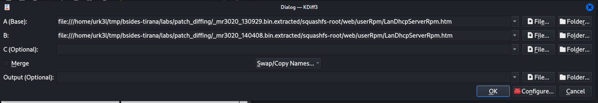
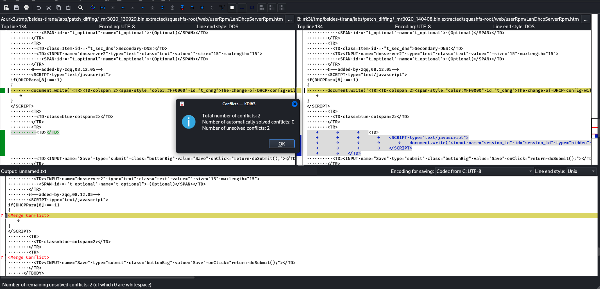

# Firmware patch diffing


1. Get both firmware extracted using binwalk

```

> binwalk -e mr3020_13029.bin

DECIMAL       HEXADECIMAL     DESCRIPTION
--------------------------------------------------------------------------------
0             0x0             TP-Link firmware header, firmware version: 0.-17300.3, image version: "", product ID: 0x0, product version: 807403521, kernel load address: 0x0, kernel entry point: 0x80002000, kernel offset: 4063744, kernel length: 512, rootfs offset: 891969, rootfs length: 1048576, bootloader offset: 2883584, bootloader length: 0
14144         0x3740          U-Boot version string, "U-Boot 1.1.4-gd0be0bfd (Sep 29 2013 - 10:06:34)"
14192         0x3770          CRC32 polynomial table, big endian
15488         0x3C80          uImage header, header size: 64 bytes, header CRC: 0xA95954C2, created: 2013-09-29 02:06:34, image size: 33196 bytes, Data Address: 0x80010000, Entry Point: 0x80010000, data CRC: 0xA3998D98, OS: Linux, CPU: MIPS, image type: Firmware Image, compression type: lzma, image name: "u-boot image"
15552         0x3CC0          LZMA compressed data, properties: 0x5D, dictionary size: 33554432 bytes, uncompressed size: 94984 bytes
131584        0x20200         TP-Link firmware header, firmware version: 0.0.3, image version: "", product ID: 0x0, product version: 807403521, kernel load address: 0x0, kernel entry point: 0x80002000, kernel offset: 3932160, kernel length: 512, rootfs offset: 891969, rootfs length: 1048576, bootloader offset: 2883584, bootloader length: 0
132096        0x20400         LZMA compressed data, properties: 0x5D, dictionary size: 33554432 bytes, uncompressed size: 2581428 bytes
1180160       0x120200        Squashfs filesystem, little endian, version 4.0, compression:lzma, size: 2535931 bytes, 606 inodes, blocksize: 131072 bytes, created: 2013-09-29 02:13:02


> binwalk -e mr3020_140408.bin

DECIMAL       HEXADECIMAL     DESCRIPTION
--------------------------------------------------------------------------------
0             0x0             TP-Link firmware header, firmware version: 0.-17160.3, image version: "", product ID: 0x0, product version: 807403521, kernel load address: 0x0, kernel entry point: 0x80002000, kernel offset: 4063744, kernel length: 512, rootfs offset: 892225, rootfs length: 1048576, bootloader offset: 2883584, bootloader length: 0
14144         0x3740          U-Boot version string, "U-Boot 1.1.4-g220aa8df (Apr  8 2014 - 08:51:34)"
14192         0x3770          CRC32 polynomial table, big endian
15488         0x3C80          uImage header, header size: 64 bytes, header CRC: 0xE7103EE2, created: 2014-04-08 00:51:34, image size: 33336 bytes, Data Address: 0x80010000, Entry Point: 0x80010000, data CRC: 0xE0E829CF, OS: Linux, CPU: MIPS, image type: Firmware Image, compression type: lzma, image name: "u-boot image"
15552         0x3CC0          LZMA compressed data, properties: 0x5D, dictionary size: 33554432 bytes, uncompressed size: 95552 bytes
131584        0x20200         TP-Link firmware header, firmware version: 0.0.3, image version: "", product ID: 0x0, product version: 807403521, kernel load address: 0x0, kernel entry point: 0x80002000, kernel offset: 3932160, kernel length: 512, rootfs offset: 892225, rootfs length: 1048576, bootloader offset: 2883584, bootloader length: 0
132096        0x20400         LZMA compressed data, properties: 0x5D, dictionary size: 33554432 bytes, uncompressed size: 2581428 bytes
1180160       0x120200        Squashfs filesystem, little endian, version 4.0, compression:lzma, size: 2594992 bytes, 624 inodes, blocksize: 131072 bytes, created: 2014-04-08 00:58:16

```

2. Open them in `kdiff3`

```
> kdiff3

```

3. Select both extracted firmware file systems, pointing to the specific file we know was patched
    - For the base, select the old firmware (_mr3020_130929.bin.extracted/squashfs-root/web/userRpm/LanDhcpServerRpm.htm)
    - For the second, select the newest firmware (_mr3020_140408.bin.extracted/squashfs-root/web/userRpm/LanDhcpServerRpm.htm)

    



    - Click `OK`





4. Check and figure out what this simple patch does :-).

---


As discussed during the workshop, you can easily come up with a way to automate this whole process, so that you can catch such low hanging fruits.

